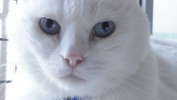

# Johanna England

Student assistant at [DIMA Group](http://www.dima.tu-berlin.de), [TU Berlin](http://www.tu-berlin.de)

## Publications 


* {{ publication.author }}: <a href="{{ publication.url }}">*{{ publication.title }}*</a>, in {{ publication.booktitle }}, {{ publication.year }}


## News

## Projects

## Teaching

This is a test 
<body>

<button type="button" onclick="light(1)">Light On</button>
<button type="button" onclick="light(0)">Light Off</button>

</body>
